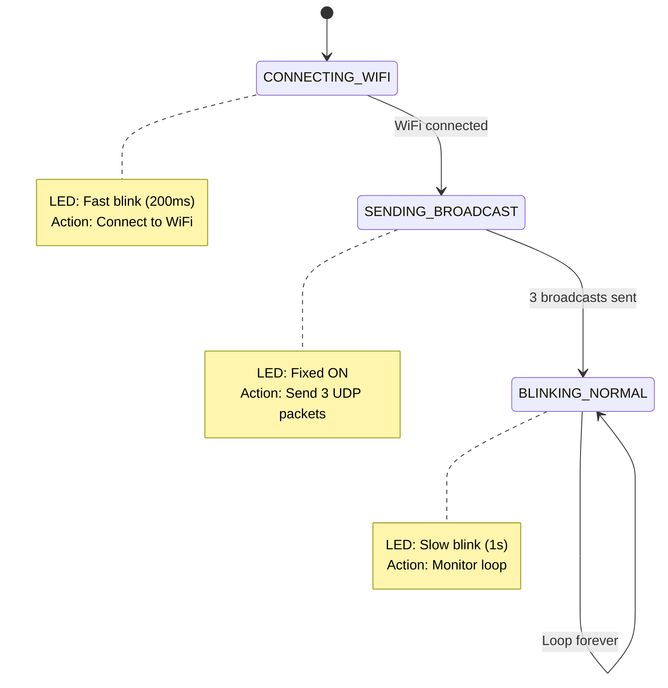

# ESP8266 UDP Broadcast

## Purpose

This program allows an ESP8266 microcontroller to broadcast a UDP message (`ESP8266_BOOT1`) to the network whenever it powers up. It's useful for device discovery or boot notifications on a local network.

### LED Behavior
- **Connecting to WiFi**: Fast blinking (200ms interval) with LED toggling rapidly
- **Sending Broadcasts**: LED stays ON (fixed) while transmitting 3 UDP packets
- **After Broadcasts**: Slow blinking (1 second interval) continuously

## State Machine Architecture

The program uses a finite state machine to manage the three main phases:



## How to Listen to the Broadcast (Linux)

Use `nc` (netcat) to listen for UDP messages on port 10666:

```bash
nc -ul 10666
```

Or with more verbose output:

```bash
nc -ul -v 10666
```

Once running, power up or reset the ESP8266. You should see the message `ESP8266_BOOT1` appear in your terminal when the device broadcasts.

## Configuration

Edit these values in `src/main.cpp` to customize:
- `ssid` and `password`: Your WiFi network credentials
- `udpPort`: Port number for broadcasting (default: 10666)
- `udpMessage`: Message content to broadcast (default: "ESP8266_BOOT1")

## Author

**GitHub Copilot with Claude Haiku 4.5** - Program implementation and optimization
